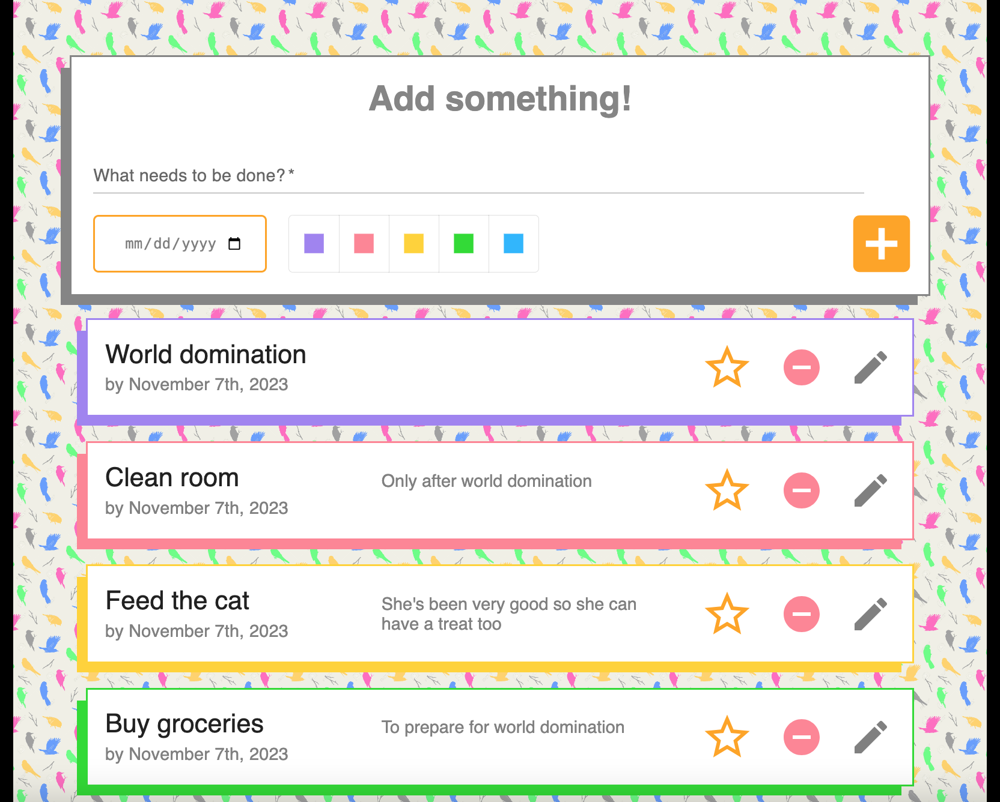

# Busy Bird To Do List 

# Description
This is a to do list with the ability to add and edit notes, add due date, and add color-coding. 

  ### Built-in sorting
  Tasks sort by `status` first (incomplete > completed),
      then `due date` (nearest date appears at the top),
      and finally `color` (the order is the same as the color selector at the top, ie. purple > > > blue)

  ### Buttons
  All of the buttons have tips that appear when hovered over. 
  If you aren't sure what a button does, just hover to find out.

  ### Scrolling
  The tasks under the submission form scroll up and down. 
  Otherwise the page remains static.

  ### Form Submission
  - The `task description` is required. 
  - The `due date` defaults to the current date. If part of it is edited, then the entire date must be edited to submit it.
  - The `color` defaults to `blue` if none is chosen.

  ### Task Editing
  - There is a 280 character limit for notes.
  - The notes on a task can be edited by clicking the `pencil` icon. 
  - Clicking the `pencil` icon a second time will close the editing window without saving.
  - The note can only be saved by clicking the `orange plus` icon next to it.
  - The `delete` button does NOT prompt before deleting! Click at your own peril.

===============================

# Instructions
FIRST: create a database named `weekend-to-do-app` and use the query in the `database.sql` file to populate it.

SECOND: You'll need to run all of these commands in terminal to start:
  - npm install pg
  - npm install express

  - npm install @mui/material @emotion/react @emotion/styled
  - npm install @fontsource/roboto
  - npm install @mui/icons-material

Finally:
  - npm run server
  - npm run client

===============================

Here is a summary of the planning that went into this:

  ### To Do List To Do List
    - ✅ Create database
    - ✅ GET tasks in App.jsx
    - ✅ Component to POST new task (TaskForm)
    - ✅ Component to DELETE specific task (TaskItem)
    - ✅ Component to PUT task and mark complete (TaskItem)
    - ✅ Set up server side on the router(s)
  ### Stretch
    - ✅ Add input to select due date
    - ✅ Add input to allow different colors for organization
    - ✅ Add styling (background, task colors, buttons, lots of formatting)
    - ✅ Make the list container scrollable
    - ✅ Add ability to add notes to tasks (new PUT function)
    - Add ability to change color of tasks (same PUT function?)

